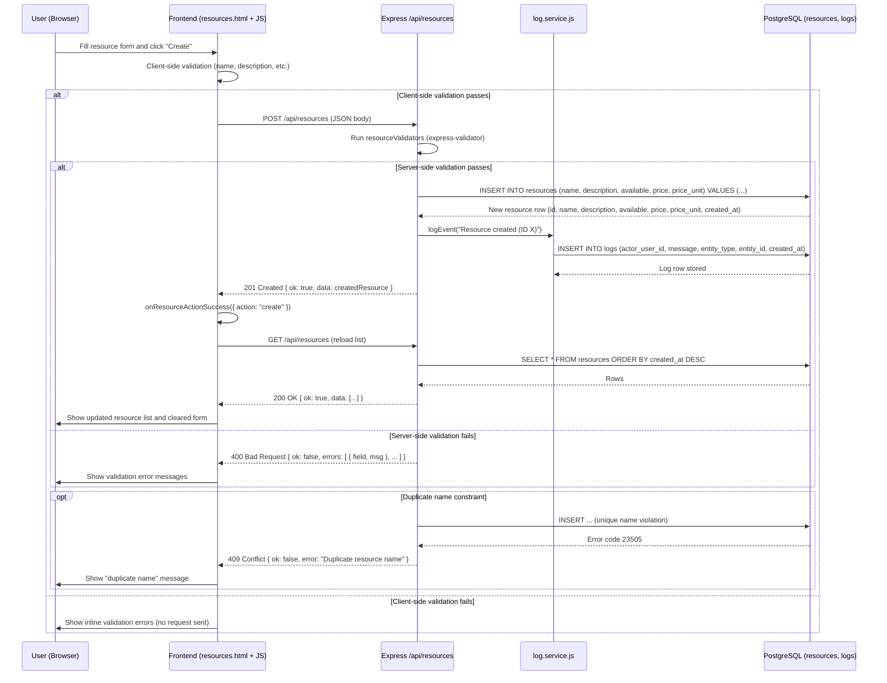
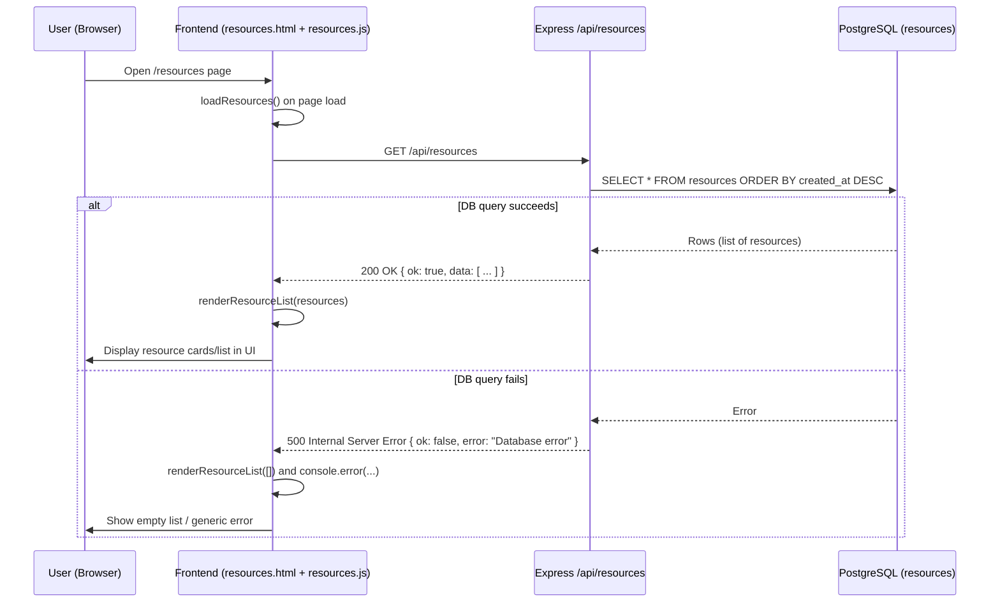
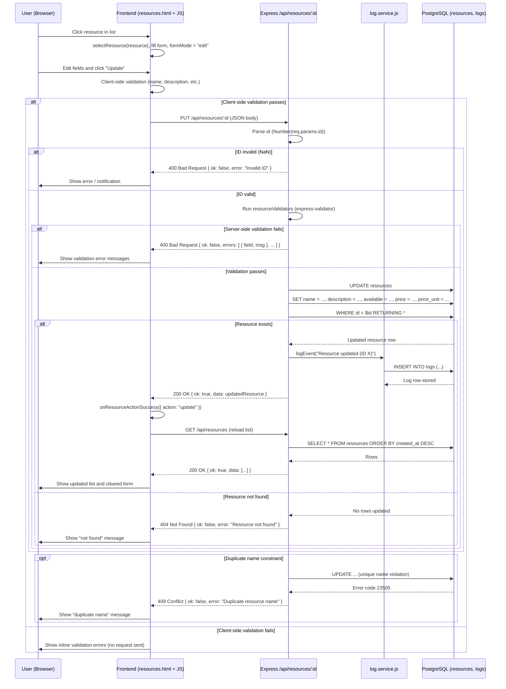
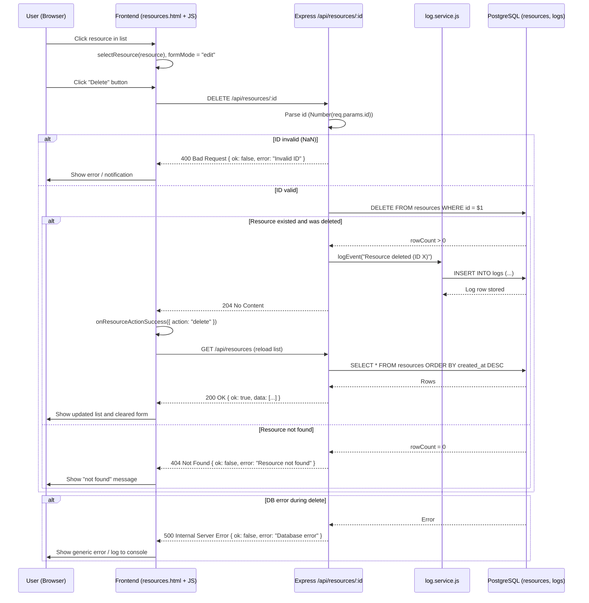

## 1️⃣ CREATE – Resource


```mermaid
sequenceDiagram
    participant U as User (Browser)
    participant FE as Frontend (resources.html + JS)
    participant API as Express /api/resources
    participant LOG as log.service.js
    participant DB as PostgreSQL (resources, logs)

    %% User fills form and clicks Create
    U->>FE: Fill resource form and click "Create"
    FE->>FE: Client-side validation (name, description, etc.)

    alt Client-side validation passes
        FE->>API: POST /api/resources (JSON body)
        API->>API: Run resourceValidators (express-validator)

        alt Server-side validation passes
            API->>DB: INSERT INTO resources (name, description, available, price, price_unit) VALUES (...)
            DB-->>API: New resource row (id, name, description, available, price, price_unit, created_at)

            %% Logging
            API->>LOG: logEvent("Resource created (ID X)")
            LOG->>DB: INSERT INTO logs (actor_user_id, message, entity_type, entity_id, created_at)
            DB-->>LOG: Log row stored

            API-->>FE: 201 Created { ok: true, data: createdResource }
            FE->>FE: onResourceActionSuccess({ action: "create" })
            FE->>API: GET /api/resources (reload list)
            API->>DB: SELECT * FROM resources ORDER BY created_at DESC
            DB-->>API: Rows
            API-->>FE: 200 OK { ok: true, data: [...] }
            FE->>U: Show updated resource list and cleared form

        else Server-side validation fails
            API-->>FE: 400 Bad Request { ok: false, errors: [ { field, msg }, ... ] }
            FE->>U: Show validation error messages
        end

        opt Duplicate name constraint
            API->>DB: INSERT ... (unique name violation)
            DB-->>API: Error code 23505
            API-->>FE: 409 Conflict { ok: false, error: "Duplicate resource name" }
            FE->>U: Show "duplicate name" message
        end

    else Client-side validation fails
        FE->>U: Show inline validation errors (no request sent)
    end
```


---

## 2️⃣ READ – Resources


```mermaid
sequenceDiagram
    participant U as User (Browser)
    participant FE as Frontend (resources.html + resources.js)
    participant API as Express /api/resources
    participant DB as PostgreSQL (resources)

    %% User opens resources page
    U->>FE: Open /resources page
    FE->>FE: loadResources() on page load

    FE->>API: GET /api/resources
    API->>DB: SELECT * FROM resources ORDER BY created_at DESC

    alt DB query succeeds
        DB-->>API: Rows (list of resources)
        API-->>FE: 200 OK { ok: true, data: [ ... ] }
        FE->>FE: renderResourceList(resources)
        FE->>U: Display resource cards/list in UI

    else DB query fails
        DB-->>API: Error
        API-->>FE: 500 Internal Server Error { ok: false, error: "Database error" }
        FE->>FE: renderResourceList([]) and console.error(...)
        FE->>U: Show empty list / generic error
    end
```


---

## 3️⃣ UPDATE – Resource


```mermaid
sequenceDiagram
    participant U as User (Browser)
    participant FE as Frontend (resources.html + JS)
    participant API as Express /api/resources/:id
    participant LOG as log.service.js
    participant DB as PostgreSQL (resources, logs)

    %% User selects a resource
    U->>FE: Click resource in list
    FE->>FE: selectResource(resource), fill form, formMode = "edit"

    %% User edits and clicks Update
    U->>FE: Edit fields and click "Update"
    FE->>FE: Client-side validation (name, description, etc.)

    alt Client-side validation passes
        FE->>API: PUT /api/resources/:id (JSON body)
        API->>API: Parse id (Number(req.params.id))

        alt ID invalid (NaN)
            API-->>FE: 400 Bad Request { ok: false, error: "Invalid ID" }
            FE->>U: Show error / notification

        else ID valid
            API->>API: Run resourceValidators (express-validator)

            alt Server-side validation fails
                API-->>FE: 400 Bad Request { ok: false, errors: [ { field, msg }, ... ] }
                FE->>U: Show validation error messages

            else Validation passes
                API->>DB: UPDATE resources
                API->>DB:  SET name = ..., description = ..., available = ..., price = ..., price_unit = ...
                API->>DB:  WHERE id = $id RETURNING *
                alt Resource exists
                    DB-->>API: Updated resource row

                    %% Logging
                    API->>LOG: logEvent("Resource updated (ID X)")
                    LOG->>DB: INSERT INTO logs (...)
                    DB-->>LOG: Log row stored

                    API-->>FE: 200 OK { ok: true, data: updatedResource }
                    FE->>FE: onResourceActionSuccess({ action: "update" })
                    FE->>API: GET /api/resources (reload list)
                    API->>DB: SELECT * FROM resources ORDER BY created_at DESC
                    DB-->>API: Rows
                    API-->>FE: 200 OK { ok: true, data: [...] }
                    FE->>U: Show updated list and cleared form

                else Resource not found
                    DB-->>API: No rows updated
                    API-->>FE: 404 Not Found { ok: false, error: "Resource not found" }
                    FE->>U: Show "not found" message
                end
            end
        end

        opt Duplicate name constraint
            API->>DB: UPDATE ... (unique name violation)
            DB-->>API: Error code 23505
            API-->>FE: 409 Conflict { ok: false, error: "Duplicate resource name" }
            FE->>U: Show "duplicate name" message
        end

    else Client-side validation fails
        FE->>U: Show inline validation errors (no request sent)
    end
```


---

## 4️⃣ DELETE – Resource


```mermaid
sequenceDiagram
    participant U as User (Browser)
    participant FE as Frontend (resources.html + JS)
    participant API as Express /api/resources/:id
    participant LOG as log.service.js
    participant DB as PostgreSQL (resources, logs)

    %% User selects a resource
    U->>FE: Click resource in list
    FE->>FE: selectResource(resource), formMode = "edit"

    %% User clicks Delete
    U->>FE: Click "Delete" button
    FE->>API: DELETE /api/resources/:id
    API->>API: Parse id (Number(req.params.id))

    alt ID invalid (NaN)
        API-->>FE: 400 Bad Request { ok: false, error: "Invalid ID" }
        FE->>U: Show error / notification

    else ID valid
        API->>DB: DELETE FROM resources WHERE id = $1

        alt Resource existed and was deleted
            DB-->>API: rowCount > 0

            %% Logging
            API->>LOG: logEvent("Resource deleted (ID X)")
            LOG->>DB: INSERT INTO logs (...)
            DB-->>LOG: Log row stored

            API-->>FE: 204 No Content
            FE->>FE: onResourceActionSuccess({ action: "delete" })
            FE->>API: GET /api/resources (reload list)
            API->>DB: SELECT * FROM resources ORDER BY created_at DESC
            DB-->>API: Rows
            API-->>FE: 200 OK { ok: true, data: [...] }
            FE->>U: Show updated list and cleared form

        else Resource not found
            DB-->>API: rowCount = 0
            API-->>FE: 404 Not Found { ok: false, error: "Resource not found" }
            FE->>U: Show "not found" message
        end
    end

    alt DB error during delete
        DB-->>API: Error
        API-->>FE: 500 Internal Server Error { ok: false, error: "Database error" }
        FE->>U: Show generic error / log to console
    end
```

```
